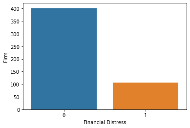
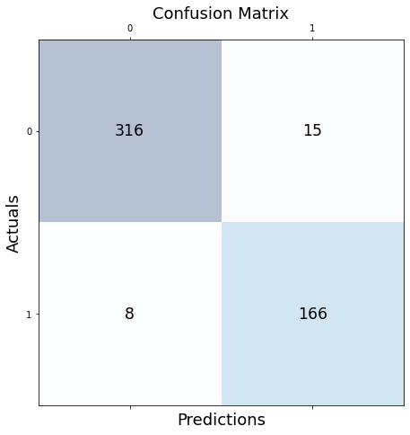
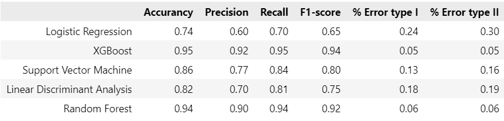
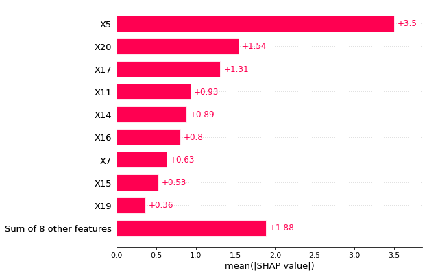
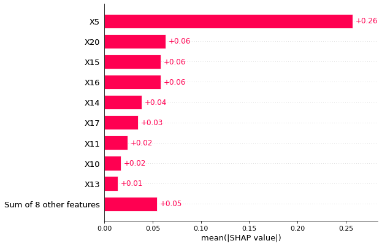
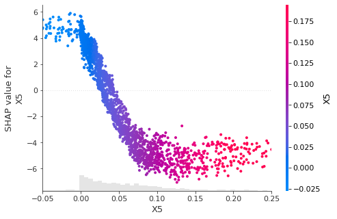
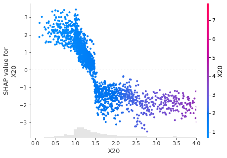

# Predicting the Financial Distress of SMEs in Vietnam using Maching Learning Models and Explaining Black-box Model with Shapley Value
---
- This project focuses on utilizing machine learning models to predict the Financial Distress probability of small and medium-sized enterprises (SMEs) in Vietnam. According to **Decree 39/2018/ND-CP dated March 11, 2018**, issued by the Prime Minister, which provides detailed regulations on some provisions of the Law on Support for Small and Medium-sized Enterprises, SMEs in Vietnam are defined as enterprises with a capitalization of **less than 100 billion VND**. Based on this definition, I collected financial data from the reports of **507 companies** on the Upcom stock exchange.

- Building on the work of (Vinh.L.H et al., 2018), who sought a suitable distress prediction model for Vietnamese enterprises, the Springate S-score model was identified as the most appropriate. Consequently, I created a binary classification criterion using the S-score model as the indicator for labeling. If a company has an **S-score < 0.862, it is labeled as 1**; otherwise, if the **S-score is ≥ 0.862, it is labeled as 0**.

- Thus, based on this criterion and the dataset of 507 small and medium-sized enterprises, I analyzed and classified the target variable into **401 companies in state 0 (Non-Distress)** and **106 companies in state 1 (Distress)**.

  

- The dataset I obtained consists of 21 variables, with their respective formulas as follows:
## Variables

| Variable Name | Formula                                                   |
|---------------|-----------------------------------------------------------|
| X1            | (Current Assets – Current Liabilities) / Total Assets      |
| X2            | Dummy variable for free cash flow (1 if X2 > 0, 0 if X2 ≤ 0)|
| X3            | (Profit Before Tax and Interest) / Total Assets            |
| X4            | Net Sales / Total Assets                                   |
| X5            | (Net Profit After Tax) / Total Assets (ROA)                |
| X6            | (Profit Before Tax) / Current Liabilities                  |
| X7            | (Profit Before Tax and Interest) / Owner's Equity (ROI)   |
| X8            | Net Cash Flow / Total Debt                                 |
| X9            | Logarithm of Tangible Assets                               |
| X10           | Logarithm of (Profit Before Tax and Interest) / Interest Expense |
| X11           | (Current Assets – Inventories) / Current Liabilities       |
| X12           | Cash / Current Liabilities                                  |
| X13           | Cost of Goods Sold / Inventories                            |
| X14           | Accounts Receivable / Net Sales                             |
| X15           | Cost of Goods Sold / Accounts Payable                       |
| X16           | Net Sales / Fixed Assets                                    |
| X17           | (Net Profit After Tax) / Net Sales (ROS)                   |
| X18           | Current Liabilities / Total Assets                          |
| X19           | Total Debt / Total Assets (Leverage)                       |
| X20           | Current Assets / Current Liabilities (Liquidity)           |
| X21           | (Net Profit After Tax) / Owner's Equity (ROE)              |

- And I use variables X1, X3, X4, X6 to calculate the target variable using the S-score model. Therefore, for the training data, I will exclude these 4 variables, resulting in a dataset with 17 remaining variables. **Due to security reasons, I am unable to disclose the dataset**.

## Result
- Therefore, after identifying and calculating the target variable, I labeled the 507 companies and processed the dataset according to the accompanying code file. Subsequently, I employed machine learning models such as Logistic Regression, Support Vector Machine, Linear Discriminant Analysis, Random Forest, and XGBoost to predict the likelihood of Financial Distress with a training and testing ratio of 80:20. Finally, I evaluated the models using metrics such as Accuracy, Precision, Recall, F1-score, and employed Confusion Matrix to calculate the rates of Error Type 1 and Error Type 2.

**Confusion Matrix of XGBoost model**

  

**Confusion Matrix of Random Forest model**

  

- Based on the results, it can be observed that both **XGBoost** and **Random Forest** models exhibit significant effectiveness, with respective accuracies of 95% and 94%. Other metrics also consistently surpass the 90% mark. Regarding Error Type 1 and Error Type 2 rates, both are minimal, and in an overall comparison, the XGBoost model demonstrates superior effectiveness compared to Random Forest, with an Error rate of only 5%.

  

## Explaining model with Shapley Value

- The machine learning problem is Black-box model. Therefore, after selecting the two best-performing models, XGBoost and Random Forest, I used an algorithm to explain the model, employing the **Shapley Additive Explanations (SHAP) method**. This algorithm is developed from game theory, **introduced in 1953 by Shapley**. Using this algorithm, I explained the machine learning model by assessing the impact of features on the model.

- The results from the SHAP algorithm indicate that, for the **XGBoost** model, variables **X5** and **X20** are identified as the **two variables contributing significantly** to predicting the Financial Distress in small and medium-sized enterprises.

  

- For the Random Forest model as well, the evaluation also highlights variables X5 and X20 as the most significant contributors to the model.

  

- Thus, the two variables that have made significant contributions to the model are X5 (ROA - Return on Assets) and X20 (Liquidity). Regarding the variable X5 (ROA), we can examine the graph illustrating the contribution level and its impact on the Shap value as follows:

  

- ROA has contributed the most to the model, showcasing its role in reflecting the Financial Distress likelihood of SMEs. With an inverse relationship with the Shap value, as the ROA of SMEs increases, the distress probability of SMEs decreases. When the ROA surpasses 5%, the Shap value becomes negative. Therefore, maintaining an ROA above 5% in small and medium-sized enterprises can help them resist financial distress.

  

- The second important indicator that SMEs need to pay attention to is the level of Liquidity. From the graph depicting the relationship between variable X20 and the Shap value, it is evident that maintaining a Liquidity level of 1.5 or higher can assist SMEs in managing short-term debts and avoiding distress situations.

## Summary
- In summary, the project has identified two machine learning models, XGBoost and Random Forest, as the best predictors for the Financial Distress likelihood of SMEs in Vietnam. Additionally, addressing the Black-box model challenge in machine learning using the SHAP algorithm has highlighted two variables, X5 (ROA) and X20 (Liquidity), as major contributors to influencing the distress level of businesses. From this project, SMEs in Vietnam can consider and carefully observe these key indicators to mitigate and navigate through potential distress situations in their enterprises.
